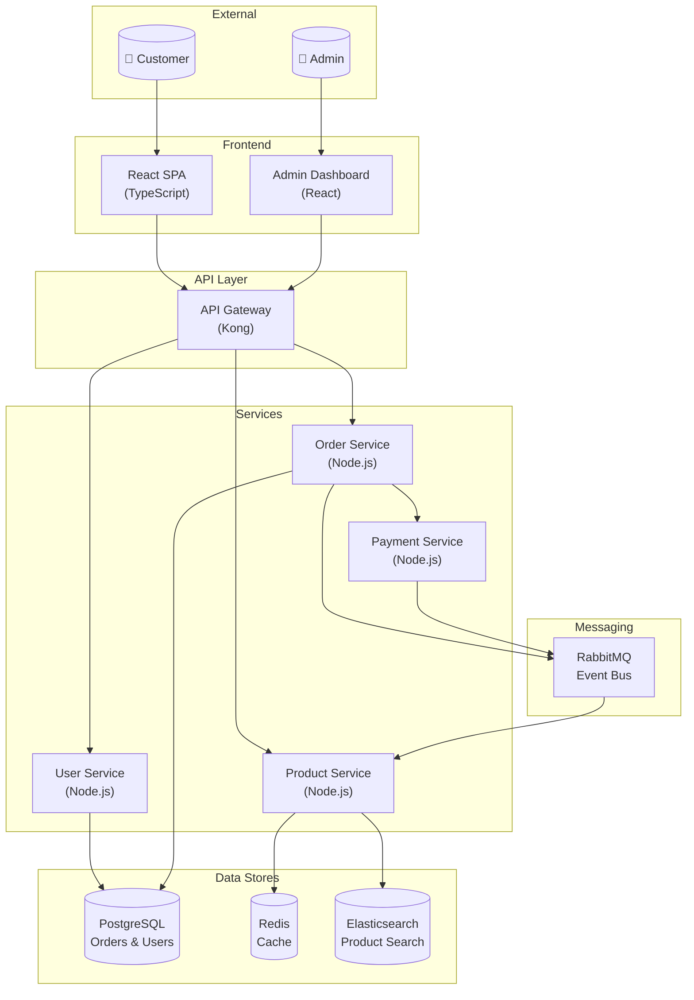
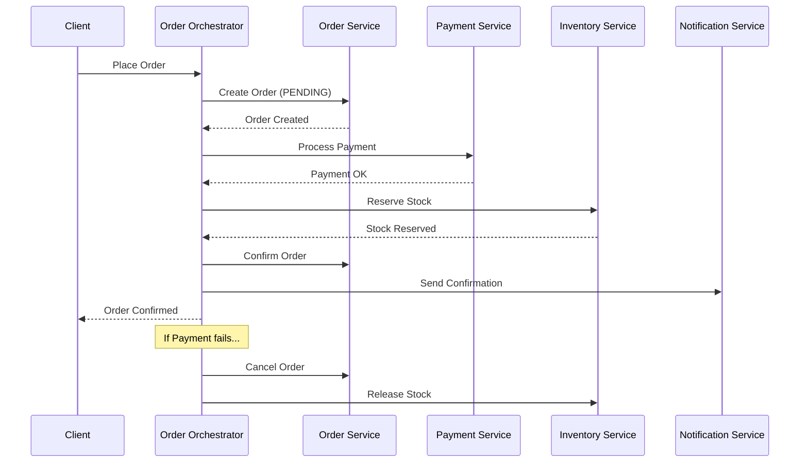

# 🟢 Copilot for Architects: AI-Assisted Design

Welcome, architect! In this course you'll learn how to use GitHub Copilot as a design thinking partner — exploring patterns, generating documentation, and visualizing systems right from your editor.

## Prerequisites

- A GitHub account with Copilot access
- VS Code with the GitHub Copilot extension installed
- Basic understanding of software architecture concepts

## Why Copilot for Architecture?

Architecture work is often about exploration and communication. Copilot excels at both:

| Architecture Task | How Copilot Helps |
|-------------------|-------------------|
| Pattern exploration | Discuss trade-offs for different approaches |
| Design documentation | Generate ADRs, RFCs, and design docs |
| System diagrams | Create Mermaid diagrams from descriptions |
| Trade-off analysis | Compare options with structured pros/cons |
| Prototyping | Quickly scaffold proof-of-concept code |

## Step 1: Explore Architectural Patterns with Chat

Open Copilot Chat and start an architecture discussion:

```
I'm designing an e-commerce platform that needs to handle 10,000 concurrent users.
Compare monolithic vs microservices architecture for this use case.
Include trade-offs for team size (8 developers), time to market (6 months),
and operational complexity.
```

Copilot will provide a structured comparison. Follow up with specifics:

```
Given that analysis, if we go with microservices, what are the top 5 services
we should extract first? Consider the bounded contexts for an e-commerce domain.
```

> 💡 **Tip:** Treat Copilot Chat as a design partner, not an oracle. Always validate its suggestions against your specific context and constraints.

## Step 2: Generate Architecture Decision Records (ADRs)

ADRs document the "why" behind architectural choices. Ask Copilot to generate one:

```
Generate an ADR for choosing PostgreSQL over MongoDB for our e-commerce platform.
Use the standard ADR format with Status, Context, Decision, and Consequences.
Consider: ACID transactions for orders, complex product queries, team expertise,
and future analytics needs.
```

**Expected output structure:**

```markdown
# ADR-001: Use PostgreSQL as Primary Database

## Status
Accepted

## Context
Our e-commerce platform requires a database that supports:
- ACID transactions for order processing and payment workflows
- Complex queries across product catalogs with filtering and sorting
- Relational data modeling for users, orders, products, and inventory
- The team has 5 years of collective PostgreSQL experience

We evaluated PostgreSQL, MongoDB, and CockroachDB.

## Decision
We will use PostgreSQL 16 as our primary database.

## Consequences

### Positive
- Strong ACID guarantees for financial transactions
- Rich query capabilities with indexes, CTEs, and window functions
- Team familiarity reduces onboarding and debugging time
- Excellent tooling ecosystem (pgAdmin, pg_dump, extensions)

### Negative
- Horizontal scaling requires additional tooling (Citus, read replicas)
- Schema migrations need careful coordination in production
- JSON querying is possible but less ergonomic than MongoDB

### Risks
- If traffic exceeds single-node capacity, we'll need to invest in
  read replicas or partitioning within 12 months
```

Store ADRs in your repository:

```
docs/
  architecture/
    decisions/
      001-postgresql-database.md
      002-event-driven-order-processing.md
      003-api-gateway-pattern.md
    diagrams/
      system-context.mmd
      container-diagram.mmd
```

## Step 3: Create Mermaid Diagrams with Copilot

Copilot can generate Mermaid diagrams from natural language descriptions. Try:

```
Create a Mermaid C4 container diagram for an e-commerce platform with:
- React frontend
- API Gateway (Kong)
- User Service, Product Service, Order Service, Payment Service
- PostgreSQL for orders, Redis for caching, Elasticsearch for product search
- RabbitMQ for async messaging between services
```

**Generated diagram:**



You can iterate on diagrams by asking Copilot to refine them:

```
Add a CDN in front of the React SPA, add a notification service
that consumes events from RabbitMQ, and show the authentication
flow through the API gateway.
```

## Step 4: Evaluate Trade-Offs with Structured Analysis

Ask Copilot to help with systematic trade-off analysis:

```
Create a weighted decision matrix for choosing a message broker.
Options: RabbitMQ, Apache Kafka, Amazon SQS.
Criteria: throughput (weight 3), operational complexity (weight 2),
ordering guarantees (weight 3), team expertise (weight 2), cost (weight 1).
Rate each 1-5.
```

**Expected output:**

| Criteria | Weight | RabbitMQ | Kafka | SQS |
|----------|--------|----------|-------|-----|
| Throughput | 3 | 3 (9) | 5 (15) | 3 (9) |
| Operational Complexity | 2 | 3 (6) | 2 (4) | 5 (10) |
| Ordering Guarantees | 3 | 4 (12) | 5 (15) | 3 (9) |
| Team Expertise | 2 | 4 (8) | 2 (4) | 3 (6) |
| Cost | 1 | 4 (4) | 3 (3) | 4 (4) |
| **Total** | | **39** | **41** | **38** |

Follow up with:

```
Based on this matrix, Kafka scores highest. But our team has no Kafka
experience. What's a realistic onboarding timeline, and would RabbitMQ
be safer given our 6-month deadline?
```

## Step 5: Design Patterns Exploration

Use Copilot to explore specific patterns relevant to your design:

```
Explain the Saga pattern for distributed transactions in our e-commerce
order processing flow. Show both choreography and orchestration approaches
with Mermaid sequence diagrams.
```

**Orchestration saga:**



## 🎯 Hands-On: Design a Microservice Architecture with Copilot

Using Copilot Chat, design a complete architecture for a **food delivery platform**:

1. **Identify bounded contexts** — ask Copilot to help map the domain
2. **Create a C4 context diagram** — show the system in its environment
3. **Generate an ADR** — document your choice of communication pattern (sync vs async)
4. **Draw a sequence diagram** — show the order placement flow
5. **Evaluate a key trade-off** — real-time tracking (WebSocket vs SSE vs polling)

Save all artifacts in a `docs/architecture/` folder in your repository.

## 🎯 What You Learned

- How to use Copilot Chat as an architecture design partner
- Generating Architecture Decision Records (ADRs)
- Creating Mermaid diagrams from natural language
- Structured trade-off analysis with decision matrices
- Exploring design patterns with visual sequence diagrams

## 📚 Glossary

- **ADR**: Architecture Decision Record — documents why a specific technical choice was made
- **C4 Model**: A hierarchical approach to diagramming software architecture (Context, Container, Component, Code)
- **Mermaid**: A Markdown-based diagramming language rendered by GitHub
- **Bounded Context**: A DDD concept defining a boundary within which a domain model applies
- **Saga Pattern**: A pattern for managing distributed transactions across microservices

## ➡️ Next Steps

Ready to scaffold real systems? Continue to:
- 🟡 [System Design with Copilot Agent Mode](/Learn-GHCP/courses/persona/architect-intermediate/)
